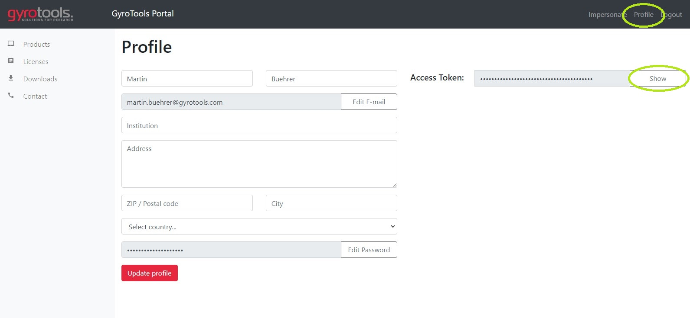

# precon 

precon is a python package for reconstruction of Philips raw data.

> **precon needs Python 3.7 or higher.**

## Installation

install precon using pip:
```python
pip install gt-precon --extra-index-url https://pypi.gyrotools.com/simple/
```

When prompted for username and password enter the credentials of the [GyroTools user portal](https://portal.gyrotools.com/portal) 

For an automated installation without password prompt (e.g. in requirements.txt) use your personal access token for the [GyroTools user portal](https://portal.gyrotools.com/portal):
```python
pip install gt-precon --extra-index-url https://precon:<PERSONAL_ACCESS_TOKEN>@pypi.gyrotools.com/simple/
```

The `<PERSONAL_ACCESS_TOKEN>` can be found in the Profile page of the [GyroTools user portal](https://portal.gyrotools.com/portal):



### Activation

Precon is a proprietary software package and needs a license to work. Please contact [GyroTools](https://www.gyrotools.com/gt/index.php/contact-form) for details and pricing. 

#### Activate precon on a single machine for all users (preferred method)

#### Windows

To activate precon for all users of a Windows machine run the following command:
```python
    python -m precon license --activate <ACTIVATION_TOKEN>
```

The `<ACTIVATION_TOKEN>` is usually received by email, but is also displayed in the [GyroTools user portal](https://portal.gyrotools.com/portal).
Upon activation a license file will be written in `C:\ProgramData\Gyrotools\license.key`. Make sure you have the necessary permissions to do so.

#### Linux / Mac

To activate precon for all users of a Linux / OSX machine first create a license file in `/etc/gyrotools` and make sure everybody has write permissions on it:
```bash
sudo mkdir -p /etc/gyrotools/ && sudo touch /etc/gyrotools/license.key && sudo chmod 666 /etc/gyrotools/license.key'
```

Afterwards activate precon with:
```python
    python -m precon license --activate <ACTIVATION_TOKEN>
```

The `<ACTIVATION_TOKEN>` is usually received by email, but is also displayed in the [GyroTools user portal](https://portal.gyrotools.com/portal).

#### Activate precon on a single machine for the current user only

If you don't have administration rights, precon can also be activated for the current user only:
```python
    python -m precon license --activate-user <ACTIVATION_TOKEN>
```

By doing so only the user which activated precon can use it. The license file will be placed into the user's home directory under `<USER_HOME>/.gyrotools/license.key`

#### Activate precon to run on multiple machines

> **_NOTE:_**  The floating license is an upgrade which needs to be purchased separately. Please contact [GyroTools](https://www.gyrotools.com/gt/index.php/contact-form) for details and pricing. 


Sometimes it is not possible (or inconvenient) to run reconstructions on a single machine. For example if the recon should be run on a cluster with many different nodes or if it is run in a container in the cloud.
For these applications precon can be activated with a floating license:

1. Obtain a license-key with:   
    ```     
    python -m precon license --get
    ```
    Follow the instructions on the screen and use the credentials of the [GyroTools user portal](https://portal.gyrotools.com/portal) to login

2. Create an environment variable called `PRECON_LICENSE_KEY` with the license-key as value. E.g:
    ```
    export PRECON_LICENSE_KEY=<YOUR_LICENSE_KEY>
    ```

**When using a floating license precon needs an active internet connection in order to connect to the GyroTools license server (https://license.gyrotools.com)**

> :warning: The obtained license-key is a personal key which is linked to your GyroTools portal account. Do not share it with anyone!
Sharing it with another non-eligible person might result in the loss of your license.

## Basic Usage

Import precon:

```
import precon as pr
```

Read the parameters from a raw file (the data must have been acquired with the ReconFrame patch):

```
pars = pr.Parameter(Path('my_rawfile.raw'))
```

Obtain a parameter:

```
vs = pars.get_voxel_sizes(mix=0)
```

Obtain a GOAL parameter by name:

```
flip_angle = pars.get_value('EX_ACQ_flip_angle', default=[90.0])
```

Please note that `get_value` always returns a list of values. If the parameter is not found then the specified default value is returned. If no default value is given `None` is returned.

Obtain a GOAL object attribute:

```
sq_base = pars.goal.get_object('SQ', 'base')
sq_base_dur = sq_base.get_attribute('dur', cmp=0)
```

Read the raw file and create k-space data:

```
parameter2read = pr.Parameter2Read(pars.labels)
for mix in parameter2read.mix:
    for stack in parameter2read.stack:
        parameter2read.stack = stack
        parameter2read.mix = mix

        # read data
        with open(args.rawfile, 'rb') as raw:
            data, labels = pr.read(raw, parameter2read, pars.labels, pars.coil_info)

        # sort and zero fill data (create k-space)
        cur_recon_resolution = pars.get_recon_resolution(mix=mix, xovs=False, yovs=True, zovs=True)
        data, labels = pr.sort(data, labels, output_size=cur_recon_resolution)
```

Please note that the read function only reads data of the same size and with the same geometry. Therefore, you should always loop over the number of mixes and stacks. 

Examples of a complete reconstruction can be found in the [examples directory](./examples).

Example data can be found in the [data directory](./data)
