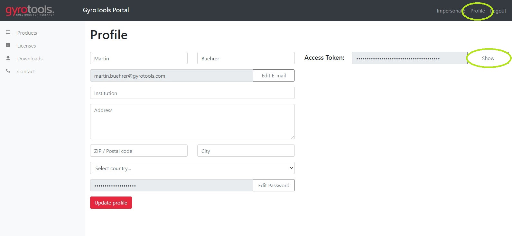

Installation
============

.. note::
    
    precon needs Python 3.7 or higher.

install precon using pip:

.. code-block:: python

    pip install gt-precon --extra-index-url https://pypi.gyrotools.com/simple/

When prompted for username and password enter the credentials for the `GyroTools user portal <https://portal.gyrotools.com/portal>`_

For an automated installation without password prompt (e.g. in requirements.txt) use your personal access token for the `GyroTools user portal <https://portal.gyrotools.com/portal>`_:

.. code-block:: python
    
    pip install gt-precon --extra-index-url https://precon:<PERSONAL_ACCESS_TOKEN>@pypi.gyrotools.com/simple/

The `<PERSONAL_ACCESS_TOKEN>` can be found in the Profile page of the `GyroTools user portal <https://portal.gyrotools.com/portal>`_:

Activation
==========

Precon is a proprietary software package and needs a license to work. Please contact `GyroTools <https://www.gyrotools.com/gt/index.php/contact-form>`_ for details and pricing. 

.. note::
    
    precon shares the same license with MRecon. If MRecon is already activated on the current machine then the activation for precon can be skipped. 

Activate on a single machine for all users (preferred method)
-------------------------------------------------------------

Windows
*******

To activate precon for all users of a Windows machine run the following command:

.. code-block:: python

    python -m precon license --activate <ACTIVATION_TOKEN>

The `<ACTIVATION_TOKEN>` is usually received by email, but is also displayed in the `GyroTools user portal <https://portal.gyrotools.com/portal>`_.
Upon activation a license file will be written in `C:\ProgramData\Gyrotools\license.key`. Make sure you have the necessary permissions to do so.

Linux / Mac
***********

To activate precon for all users of a Linux / OSX machine first create a license file in `/etc/gyrotools` and make sure everybody has write permissions on it:

.. code-block:: bash
    
    sudo mkdir -p /etc/gyrotools/ && sudo touch /etc/gyrotools/license.key && sudo chmod 666 /etc/gyrotools/license.key'

Then activate precon with:

.. code-block:: python

    python -m precon license --activate <ACTIVATION_TOKEN>

The `<ACTIVATION_TOKEN>` is usually received by email, but is also displayed in the `GyroTools user portal <https://portal.gyrotools.com/portal>`_.

Activate on a single machine for the current user only
------------------------------------------------------

If you don't have administration rights, precon can also be activated for the current user only:

.. code-block:: python

    python -m precon license --activate-user <ACTIVATION_TOKEN>

By doing so only the user which activated precon can use it. The license file will be placed into the user's home directory under `<USER_HOME>/.gyrotools/license.key`

Activate precon to run on multiple machines
-------------------------------------------

.. note::
    
    The floating license is an upgrade which needs to be purchased separately. Please contact `GyroTools <https://www.gyrotools.com/gt/index.php/contact-form>`_ for details and pricing. 

Sometimes it is not possible (or inconvenient) to run reconstructions on a single machine. For example if the recon should be run on a cluster with many different nodes or if it is run in a container in the cloud.
For these applications precon can be activated with a floating license:

1. Obtain a license-key with: 

    .. code-block:: python

        python -m precon license --get
    
    Follow the instructions on the screen and use the credentials of the `GyroTools user portal <https://portal.gyrotools.com/portal>`_ to login

2. Create an environment variable called `PRECON_LICENSE_KEY` with the license-key as value. E.g:
    
    .. code-block:: python

        export PRECON_LICENSE_KEY=<YOUR_LICENSE_KEY>    

.. important::
    
    Using a floating license, needs an active internet connection in order to connect to the GyroTools license server (https://license.gyrotools.com)

To test if precon is activated you can print the license information:

.. code-block:: python

    python -m precon license --info

.. warning:: 

    The obtained license-key is a personal key which is linked to your GyroTools portal account. Do not share it with anyone! Sharing it with another non-eligible person might result in the loss of your license.
